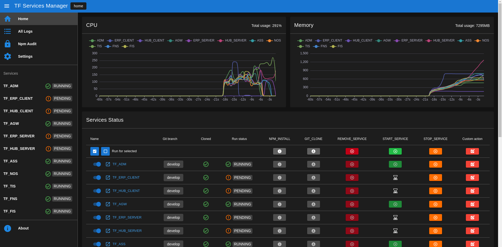
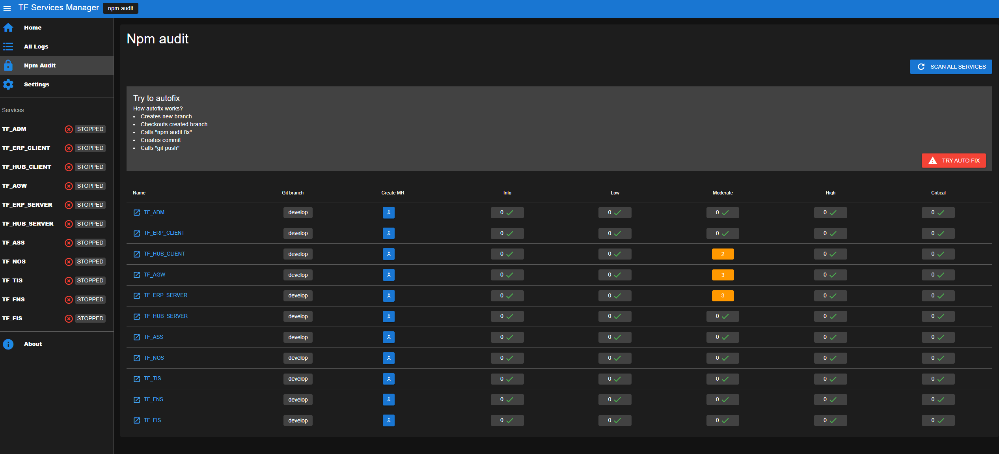
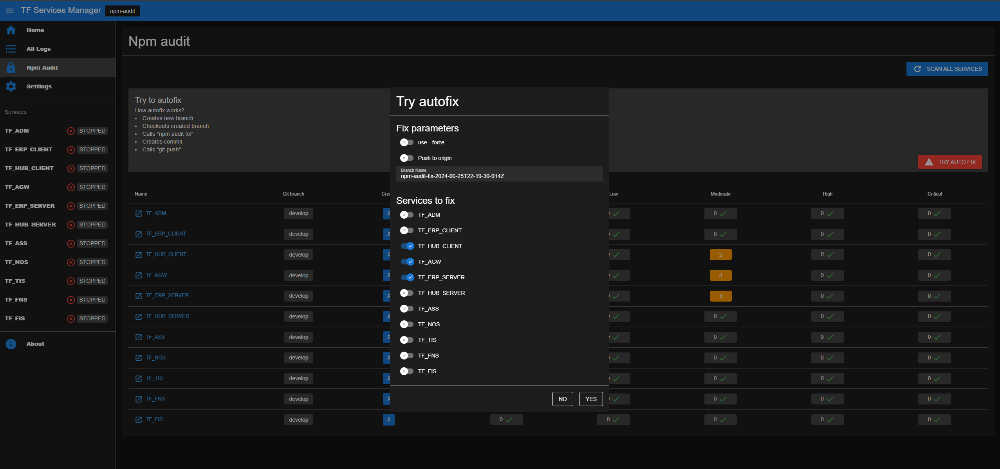
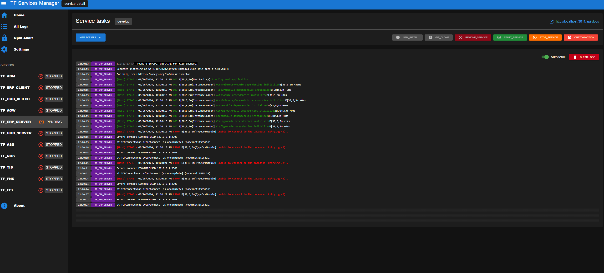
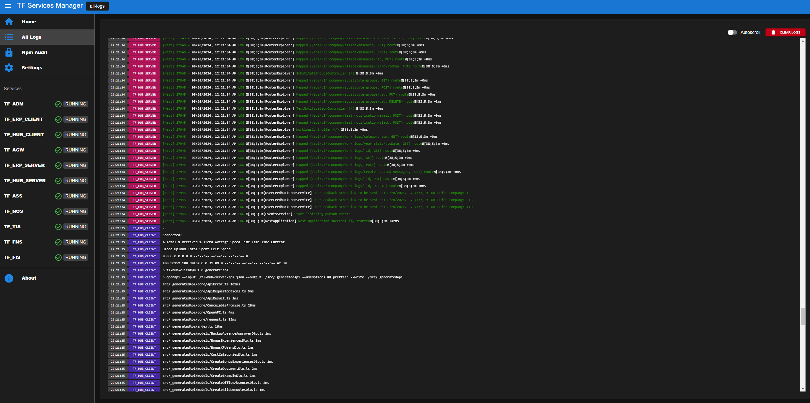

# Free from TechFides ❤️
* https://techfides.cz
* https://team.techfides.cz/
* https://techfides.eu
---


# TF Service Manager

Service manager for node.js ecosystem and local development, suited for microservices architecture.

# Features
* Service management
  * running standard tasks
  * running npm commands
* Monitoring
  * CPU usage
  * RAM usage
  * Logs
* Npm 
  * npm audit dashboard
  * npm audit auto fix
* Git
  * clone
  * reset changes
  * create merge request (gitlab only)

# Quick start
1. clone this repo
2. run `npm i`
3. run `cp ./server/.env.example ./server/.env`
4. edit file `./server/config.example.json`
5. `npm start`
6. open http://localhost:5173/

# Configuration

The project is configured via a single JSON file. To use the file, specify
its location in the `SERVICE_MANAGER_CONFIG_FILE` environment variable when
starting the server.

The file has the following format:

```json
{
  "services": [
    {
      "name": "SERVICE",
      "npmRunLifecycle": "dev",
      "gitUrl": "gitlab.com/organization/repository",
      "port": 3000,
      "appUrlSuffix": "api-docs",
      "color": "teal-9",
      "genericTasks": [
        "COPY_ENV"
      ],
      "tasks": [
        {
          "name": "COPY_ENV_PROD",
          "command": "cp .env.prod .env",
          "color": "red-1",
          "runIfNotCloned": false,
          "icon": "priority_high"
        }
      ],
      "defaultGitBranch": "develop"
    }
  ],
  "generic_tasks": [
    {
      "name": "COPY_ENV",
      "command": "cp .env.example .env",
      "color": "red-1",
      "runIfNotCloned": false,
      "runIfRunStatusIs": [ "STOPPED" ],
      "icon": "file_copy"
    },
    {
      "name": "PRINT_NAME",
      "command": "echo \"Hello, I am %{service}\"",
      "color": "red-1",
      "runIfNotCloned": false,
      "icon": "person"
    }
  ],
  "services_directory": "../../../services",
  "git_interval": 5
}
```

## Services

Services consist of the following configuration options

- `name` - the name shown in the frontend
- `npmRunLifecycle` - the run lifecycle to use with `START_SERVICE` task
- `gitUrl` - URL to the git repository
- `port` - port the service uses
- `appUrlSuffix` - added to app URL in frontend
- `color` - service's color in FE, see https://quasar.dev/style/color-palette
- `genericTasks` - names of generic tasks to use, these are defined in the generic tasks section (optional)
- `tasks` - list of tasks defined for the service (optional)
- `defaultGitBranch` - branch to checkout with GIT\_CHECKOUT command when no branch is provided via an attribute

## Tasks

Tasks consist of the following configuration options

- `name` - name of the task
- `command` - task command
- `color` - currently unused (optional), see https://quasar.dev/style/color-palette
- `runIfNotCloned` - whether the task can be run when the repository isn't cloned
- `runIfRunStatusIs` - list of run states when the task can be performed (optional, if not specified, all run states are assumed), the possible states are `RUNNING`, `PENDING`, `STOPPED`
- `icon` - icon displayed next to the task name (icon names are from the "Material Symbols and Icons" set)

## Generic Tasks

Same as regular tasks, but can be used in multiple services via the `genericTasks` configuration

## Other

- `services_directory` - path to the directory where git repositories will be stored
- `git_interval` - how often (in seconds) `git fetch` is called for each repository after it is cloned (used to indicate new commits in the upstream) (0 = never)

## Substitution

You can specify multiple special sequences that will be replaced based on the operating system and service. These sequences include

- `%{rm}` - delete command for the operating system
- `%{npmCommand}` - NPM command for the operating system
- `%{service}` - service name

# Gallery
## Npm Audit page


## Npm audit fix dialog


# Service detail page


# All logs page
